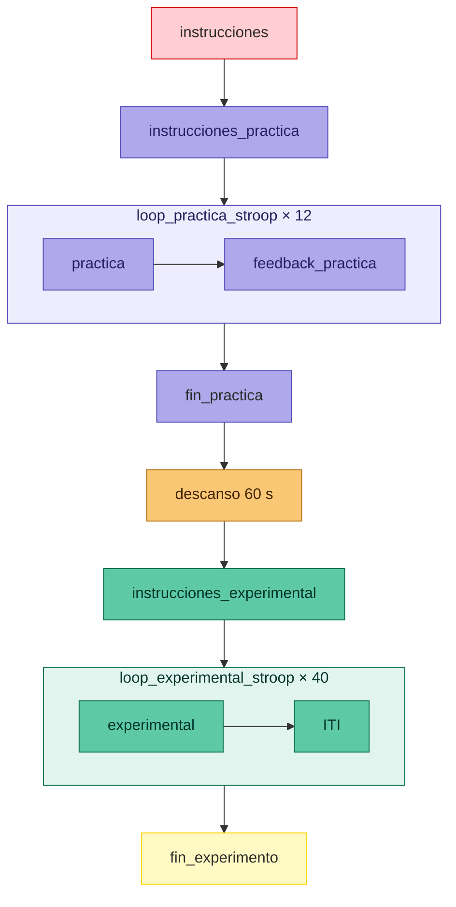

# Taller 2 — Tarea Stroop

- **Asignatura:** Investigación e Intervención desde las Neurociencias Aplicadas  
- **Ciclo:** 2026-1  
- **Autor:** Marcelo Landa

---

## Descripción

Este documento describe los materiales del Taller 2 del curso, centrado en el diseño e implementación de la tarea Stroop en PsychoPy Builder. La tarea implementa el paradigma clásico color-palabra con respuestas manuales mediante teclado, introducido originalmente por Stroop (1935) y revisado de forma exhaustiva por MacLeod (1991).

> **Nota:** El archivo `.psyexp` será completado durante el taller. Al finalizar la semana se subirá la versión resuelta a este repositorio.

---

## Cómo descargar los materiales

1. Hacer clic en el botón verde **`< > Code`** en la parte superior de esta página
2. Seleccionar **`Download ZIP`**
3. Descomprimir el archivo en tu computadora
4. Abrir PsychoPy Builder y cargar el archivo `stroop_task.psyexp`

> **Importante:** No mover ni renombrar ninguna carpeta. PsychoPy necesita encontrar los archivos exactamente en las rutas que se configurarán durante el taller.

---

## Estructura del repositorio

```
taller_2_atencion/
│
├── stroop_task.psyexp                  # Archivo del experimento (se completa en el taller)
│
├── conditions/
│   ├── condiciones_experimental.xlsx   # 48 trials — fase experimental
│   └── condiciones_practica.xlsx       # 8 trials — fase de práctica
│
├── docs/
│   ├── instrucciones_stroop.docx # Docx con las instrucciones de la tarea
│   └── guia_materiales_taller2.docx # # Docx con la guia de los materiales del taller 2
│
├── media/
│   └── instructions/                  # Instrucciones en .png para PsychoPy
│       ├── 1_instrucciones.png
│       ├── 2_instrucciones_practica.png
│       ├── 3_fin_practica.png
│       ├── 4_descanso.png
│       ├── 5_instrucciones_experimental.png
│       └── 6_fin_experimento.png
│
└── README.md
```

---

## Diseño de la tarea

| Parámetro | Valor |
|---|---|
| Paradigma | Stroop color-palabra, denominación del color de la tinta |
| Colores | Rojo, Verde, Amarillo, Azul |
| Condiciones | Congruente (palabra = color de tinta) e Incongruente (palabra ≠ color de tinta) |
| Teclas de respuesta | A (rojo) · S (verde) · K (amarillo) · L (azul) |
| Trials de práctica | 8 (1 congruente + 1 incongruente por color, con feedback) |
| Trials experimentales | 48 (6 congruentes + 6 incongruentes por color) |
| Tiempo límite por trial | 1500 ms |
| ITI | 500 ms |
| Feedback | Solo en fase de práctica |
| Variables de la tarea | Precisión (% correcto), RT (ms) y Efecto Stroop (RT incongruente − RT congruente) |

### Flujo de la tarea



---

## Análisis de resultados

Una vez completada la tarea, el CSV generado por PsychoPy puede procesarse en la aplicación web del curso:

**🔗 [mlandaf.github.io/taller_2_resultados](https://mlandaf.github.io/taller_2_resultados)**

No se requiere instalar ningún software adicional. Solo arrastra tu archivo CSV al navegador.

---

## Referencias

MacLeod, C. M. (1991). Half a century of research on the Stroop effect: An integrative review. *Psychological Bulletin, 109*(2), 163-203. https://doi.org/10.1037/0033-2909.109.2.163

Stroop, J. R. (1935). Studies of interference in serial verbal reactions. *Journal of Experimental Psychology, 18*, 643-662. https://doi.org/10.1037/h0054651

Peirce, J. W., Gray, J. R., Simpson, S., MacAskill, M. R., Hochenberger, R., Sogo, H., Kastman, E., & Lindelov, J. (2019). PsychoPy2: Experiments in behavior made easy. *Behavior Research Methods*. https://doi.org/10.3758/s13428-018-01193-y

---

## Contacto

**Marcelo Landa**  
Asistente de cátedra — Investigación e Intervención desde las Neurociencias Aplicadas  
Universidad de Lima
